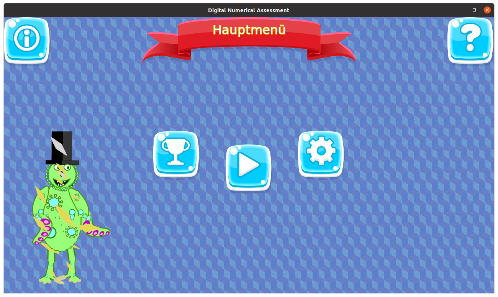
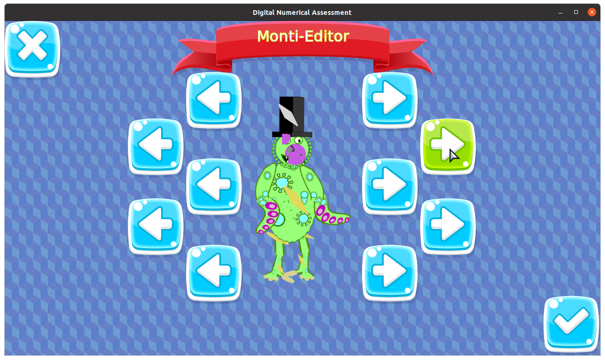
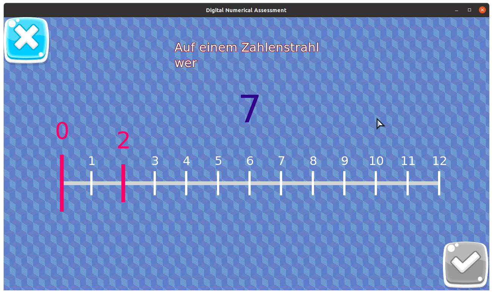

# Digital Numeracy Assessment (DNA)

The goal of this project is to create a psychological test that can be used to measure the mathematical abilities of elementary school children.
It is written in [Haxe](https://haxe.org/) so it can easily be made available on multiple different platforms.
The project uses the [Haxeflixel](https://haxeflixel.com/) framework.
The project is currently still in development, however there are some releases available if you would like to test it.

For animations we use the Dragonbones runtime for Haxeflixel (https://github.com/openfl/dragonbones).
Also I am using the [holy mother of all textboxes](https://github.com/Eiyeron/Textbox) for Haxeflixel to show Text with nice effects.

## Features so far

- Monster editor with exchangeable bodyparts.
- Unlock system for said bodyparts.
- Server upload for data (server application is in its own repository).
- adjustable sound volume.
- language settings (so far the text is only available in german but it could be easily translated).
- A few Tasks already implemented (Numberline, Arithmetic,..) with audio and visual tutorials.
- support for Windows, html5, Linux and android.

## Planned Features 

- load Trials from server (actually everything is working but we load stuff locally in order to keep things simple while in development).
- more Tasks.
- nicer looking Monsters.
- iOS support.

### Screenshots

### Credits

- The GUI was created by pzUH and shared with a public domain license. Downloaded from https://opengameart.org/content/free-game-gui. Thank you! 

- The interface sounds were created/distributed by Kenney (www.kenney.nl) shared with a public domain license. Downloaded from www.kenney.nl. Thank you! 

### Assets

The assets that are not mentioned in the credits section were created by me and can be used freely, should you wish to do so (unlikely but possible).